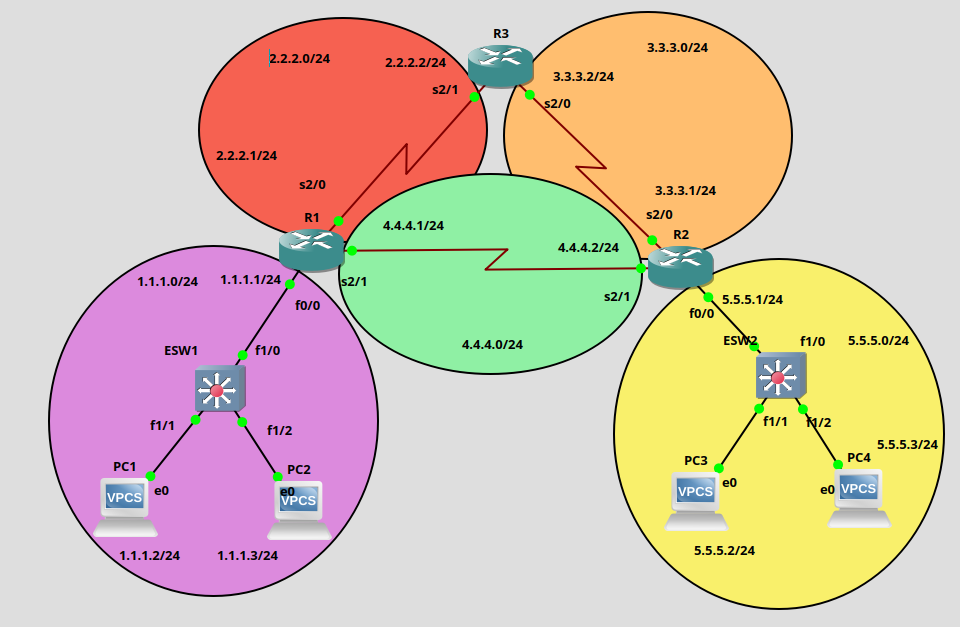

# 🌐 Static Routing Lab — Cisco IOS (GNS3 / Packet Tracer)

> A hands-on networking lab demonstrating static routing configuration across three routers, two LANs, and five interconnected networks using Cisco IOS commands.

---

## 📋 Table of Contents

- [Overview](#overview)
- [Network Topology](#network-topology)
- [Network Addressing](#network-addressing)
- [Device Configuration](#device-configuration)
  - [Router R1](#router-r1)
  - [Router R2](#router-r2)
  - [Router R3](#router-r3)
  - [End Devices (VPCS)](#end-devices-vpcs)
- [Command Reference](#command-reference)
- [Verification & Testing](#verification--testing)
- [Key Concepts](#key-concepts)
- [Tools Used](#tools-used)

---

## Overview

This lab simulates a small enterprise network with **static routing** as the sole routing mechanism. There is no dynamic routing protocol (RIP, OSPF, EIGRP), no DHCP, and no Layer 2 switch configuration required. The goal is to achieve full end-to-end connectivity between all devices using manually configured static routes.

**What this lab covers:**
- Interface IP addressing on Cisco routers
- Static route configuration and next-hop logic
- WAN serial link setup between routers
- LAN FastEthernet configuration
- End-device (VPCS) IP assignment and gateway setup
- Route verification and connectivity testing

---

## Network Topology

> 📸 **Topology Screenshot**
>
> <!-- Replace this block with your actual topology image -->

 

---

## Network Addressing

### WAN Links (Router-to-Router)

| Link        | Network       | Router | Interface | IP Address  |
|-------------|---------------|--------|-----------|-------------|
| R1 ↔ R3    | 2.2.2.0/24    | R1     | s2/0      | 2.2.2.1/24  |
|             |               | R3     | s2/1      | 2.2.2.2/24  |
| R2 ↔ R3    | 3.3.3.0/24    | R2     | s2/0      | 3.3.3.1/24  |
|             |               | R3     | s2/0      | 3.3.3.2/24  |
| R1 ↔ R2    | 4.4.4.0/24    | R1     | s2/1      | 4.4.4.1/24  |
|             |               | R2     | s2/1      | 4.4.4.2/24  |

### LAN Segments

| Network      | Router | Interface | Gateway     | Devices         |
|--------------|--------|-----------|-------------|-----------------|
| 1.1.1.0/24   | R1     | f0/0      | 1.1.1.1/24  | PC1, PC2 (ESW1) |
| 5.5.5.0/24   | R2     | f0/0      | 5.5.5.1/24  | PC3, PC4 (ESW2) |

### End Devices

| Device | IP Address  | Default Gateway |
|--------|-------------|-----------------|
| PC1    | 1.1.1.2/24  | 1.1.1.1         |
| PC2    | 1.1.1.3/24  | 1.1.1.1         |
| PC3    | 5.5.5.2/24  | 5.5.5.1         |
| PC4    | 5.5.5.3/24  | 5.5.5.1         |

---

## Device Configuration

### Router R1

```bash
R1> enable
R1# configure terminal

! --- WAN interface toward R3 ---
R1(config)# interface serial 2/0
R1(config-if)# ip address 2.2.2.1 255.255.255.0
R1(config-if)# no shutdown

! --- WAN interface toward R2 ---
R1(config-if)# interface serial 2/1
R1(config-if)# ip address 4.4.4.1 255.255.255.0
R1(config-if)# no shutdown

! --- LAN interface toward ESW1 ---
R1(config-if)# interface fastethernet 0/0
R1(config-if)# ip address 1.1.1.1 255.255.255.0
R1(config-if)# no shutdown
R1(config-if)# exit

! --- Static routes ---
R1(config)# ip route 3.3.3.0 255.255.255.0 2.2.2.2
R1(config)# ip route 5.5.5.0 255.255.255.0 4.4.4.2

R1(config)# end
R1# write memory
```

---

### Router R2

```bash
R2> enable
R2# configure terminal

! --- WAN interface toward R3 ---
R2(config)# interface serial 2/0
R2(config-if)# ip address 3.3.3.1 255.255.255.0
R2(config-if)# no shutdown

! --- WAN interface toward R1 ---
R2(config-if)# interface serial 2/1
R2(config-if)# ip address 4.4.4.2 255.255.255.0
R2(config-if)# no shutdown

! --- LAN interface toward ESW2 ---
R2(config-if)# interface fastethernet 0/0
R2(config-if)# ip address 5.5.5.1 255.255.255.0
R2(config-if)# no shutdown
R2(config-if)# exit

! --- Static routes ---
R2(config)# ip route 2.2.2.0 255.255.255.0 3.3.3.2
R2(config)# ip route 1.1.1.0 255.255.255.0 4.4.4.1

R2(config)# end
R2# write memory
```

---

### Router R3

```bash
R3> enable
R3# configure terminal

! --- WAN interface toward R1 ---
R3(config)# interface serial 2/1
R3(config-if)# ip address 2.2.2.2 255.255.255.0
R3(config-if)# no shutdown

! --- WAN interface toward R2 ---
R3(config-if)# interface serial 2/0
R3(config-if)# ip address 3.3.3.2 255.255.255.0
R3(config-if)# no shutdown
R3(config-if)# exit

! --- Static routes ---
R3(config)# ip route 4.4.4.0 255.255.255.0 2.2.2.1
R3(config)# ip route 1.1.1.0 255.255.255.0 2.2.2.1
R3(config)# ip route 5.5.5.0 255.255.255.0 3.3.3.1

R3(config)# end
R3# write memory
```

> **Note:** R3 acts as a transit router only. It has no directly connected LAN, but it must have routes to reach both LANs to forward traffic correctly.

---

### End Devices (VPCS)

VPCS uses a single command to set IP address, subnet mask (via prefix), and default gateway.

```bash
# PC1
PC1> ip 1.1.1.2/24 1.1.1.1

# PC2
PC2> ip 1.1.1.3/24 1.1.1.1

# PC3
PC3> ip 5.5.5.2/24 5.5.5.1

# PC4
PC4> ip 5.5.5.3/24 5.5.5.1
```

---

## Command Reference

This section explains every command used in this lab.

### Privileged & Global Config Mode

| Command | Description |
|---|---|
| `enable` | Enters **privileged EXEC mode** (from user mode). Required before any configuration. |
| `configure terminal` | Enters **global configuration mode**. All interface and routing commands are entered here. |
| `end` | Exits config mode and returns to privileged EXEC mode. Equivalent to pressing `Ctrl+Z`. |
| `write memory` | Saves the running configuration to NVRAM so it persists after a reboot. Also written as `copy running-config startup-config`. |

---

### Interface Configuration

| Command | Description |
|---|---|
| `interface serial 2/0` | Selects a **serial interface** (used for WAN/point-to-point links between routers). The slot/port number depends on your device. |
| `interface fastethernet 0/0` | Selects a **FastEthernet interface** (used for LAN connections, typically connected to a switch). |
| `ip address <IP> <mask>` | Assigns an **IPv4 address and subnet mask** to the selected interface. Example: `ip address 4.4.4.1 255.255.255.0` |
| `no shutdown` | **Activates** the interface. By default, router interfaces are administratively shut down. This command brings them up. |
| `exit` | Exits the current interface sub-mode and returns to global configuration mode. |

---

### Static Routing

```
ip route <destination-network> <subnet-mask> <next-hop-IP>
```

| Parameter | Description |
|---|---|
| `destination-network` | The remote network you want to reach (e.g., `5.5.5.0`). |
| `subnet-mask` | The subnet mask of the destination network (e.g., `255.255.255.0`). |
| `next-hop-IP` | The IP address of the **directly connected neighboring router** that will forward packets toward the destination. |

**Example:**
```bash
R1(config)# ip route 5.5.5.0 255.255.255.0 4.4.4.2
```
> "To reach the 5.5.5.0/24 network, send packets to 4.4.4.2 (R2's interface on the shared WAN link)."

---

### VPCS (Virtual PC Simulator)

| Command | Description |
|---|---|
| `ip <IP>/<prefix> <gateway>` | Sets the PC's **IP address**, **subnet mask** (in CIDR notation), and **default gateway** in one command. Example: `ip 1.1.1.2/24 1.1.1.1` |
| `ping <IP>` | Sends ICMP echo requests to test connectivity to another device. |
| `show ip` | Displays the current IP configuration of the VPCS device. |

---

### Switches (ESW1 / ESW2)

In this lab, the switches require **no configuration**. They operate at Layer 2, forwarding frames based on MAC addresses within the same LAN segment. All ports belong to the default VLAN 1, and no VLANs, trunks, or spanning-tree changes are needed.

> If you were using Cisco IOS switches and wanted to verify their state, these read-only commands are useful:

| Command | Description |
|---|---|
| `show mac address-table` | Displays the MAC address table (which MAC is on which port). |
| `show interfaces status` | Shows the link status of all switch ports. |
| `show vlan brief` | Lists all VLANs and their assigned ports. |

---

## Verification & Testing

Run these commands after completing the configuration to validate full connectivity.

### On each router

```bash
! Check interface IP addresses and status (up/up is expected)
show ip interface brief

! Display the full routing table
show ip route

! Test reachability to a remote LAN
ping 5.5.5.2       ! From R1, should reach PC3
ping 1.1.1.2       ! From R2, should reach PC1
```

### On VPCS

```bash
! From PC1 — ping across the network to PC3
PC1> ping 5.5.5.2

! From PC4 — ping to PC2
PC4> ping 1.1.1.3
```

### Expected routing table output (R1 example)

```
R1# show ip route

C    1.1.1.0/24  is directly connected, FastEthernet0/0
C    2.2.2.0/24  is directly connected, Serial2/0
C    4.4.4.0/24  is directly connected, Serial2/1
S    3.3.3.0/24  [1/0] via 2.2.2.2
S    5.5.5.0/24  [1/0] via 4.4.4.2
```

> `C` = Connected (directly attached network)
> `S` = Static (manually configured route)
> `[1/0]` = Administrative distance / metric

---

## Key Concepts

**Static Routing** — Routes are manually entered by the network administrator. The router has no automatic discovery mechanism. Every router must have a route to every network it is not directly connected to.

**Next-hop address** — The IP address of the neighboring router's interface on the shared link. Packets are forwarded to the next-hop, which then decides where to send them next.

**Administrative Distance (AD)** — A value indicating the trustworthiness of a route source. Static routes have an AD of `1` (very trusted), just below directly connected routes (AD `0`).

**`no shutdown`** — Cisco router interfaces are disabled by default. This is different from switches, where ports are active by default. Always remember to enable interfaces explicitly.

**`write memory`** — The running configuration lives in RAM and is lost on reboot. This command copies it to NVRAM (startup config) for persistence.

---

## Tools Used

- **GNS3** — Network emulation platform
- **Cisco IOS** — Router operating system (emulated via GNS3 or Packet Tracer)
- **VPCS** — Virtual PC Simulator for lightweight end-host simulation
- **Ethernet Switch (ESW)** — Layer 2 switch (no configuration required in this lab)

---

*Lab designed for educational purposes — static routing fundamentals.*
